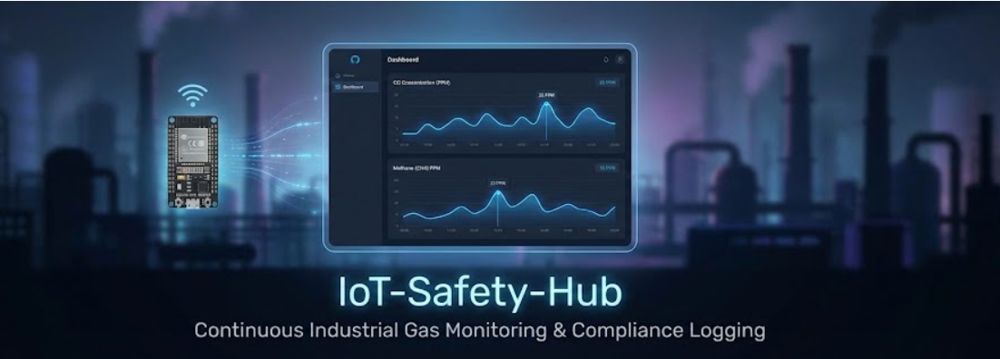

<div align="center">
  
</div>

# 🛡️ IoT-Safety-Hub

Edge-based gas monitoring and compliance logging system built with ESP32, FastAPI, SQLite, and Streamlit.

---

## Overview

IoT-Safety-Hub is a LAN-deployed monitoring system designed to:

- Continuously ingest gas sensor data
- Persist readings in a structured SQL database
- Provide real-time visualization
- Generate exportable audit logs

The system replaces standalone reactive alarms with persistent, queryable records.

---

## Features

- RESTful ingestion endpoint
- Schema validation with Pydantic
- SQLite persistence via SQLAlchemy ORM
- Background escalation engine (non-blocking)
- Live dashboard with 5s polling interval
- CSV export for audit compliance
- Fully local (no cloud dependency)

---

## Architecture

```text
ESP32 (MQ-7, MQ-4 Sensors)
       ↓ HTTP POST (JSON)
FastAPI Backend
       ↓
SQLite Database
       ↓
Streamlit Dashboard
```

### Stack

- **Hardware:** ESP32
- **Backend:** FastAPI, SQLAlchemy, Pydantic
- **Database:** SQLite
- **Frontend:** Streamlit, Pandas
- **Protocol:** HTTP (LAN)

---

## Repository Structure

```text
iot-safety-hub/
│
├── backend/
│   ├── main.py
│   └── requirements.txt
│
├── frontend/
│   ├── app.py
│   └── requirements.txt
│
└── hardware/
    └── esp32_firmware.ino
```

---

## Getting Started

### 1. Clone the Repository

```bash
git clone <repo-url>
cd iot-safety-hub
```

### 2. Backend Setup

```bash
cd backend
python -m venv venv
venv\Scripts\activate      # Windows
# source venv/bin/activate # macOS/Linux

pip install -r requirements.txt
uvicorn main:app --host 0.0.0.0 --port 8000 --reload
```
* **API will be available at:** `http://localhost:8000`
* **Interactive docs:** `http://localhost:8000/docs`

### 3. Frontend Setup
Open a new terminal:

```bash
cd frontend
python -m venv venv
venv\Scripts\activate
pip install -r requirements.txt
streamlit run app.py
```
* **Dashboard runs at:** `http://localhost:8501`

### 4. Hardware Setup

1. Connect ESP32 to your local network.
2. Update `hardware/esp32_firmware.ino`:
   ```cpp
   const char* serverName = "http://<YOUR_LOCAL_IP>:8000/ingest";
   ```
3. Upload firmware using Arduino IDE.
4. Ensure your firewall allows port 8000.

---

## API Reference

### `POST /ingest`
Ingest sensor data.

**Request Body**
```json
{
  "mq7_ppm": 25.5,
  "mq4_ppm": 10.2,
  "temperature": 30.5,
  "humidity": 55.0
}
```

**Responses**
- `200 OK` – Data stored successfully
- `422 Unprocessable Entity` – Schema validation failed
- `500 Internal Server Error` – Unexpected backend error

---

## Design Decisions

- **FastAPI** selected for async performance and automatic OpenAPI documentation.
- **SQLite** chosen for zero-configuration edge deployment.
- **Polling (5s)** used instead of WebSockets for stability and simplicity.
- **LAN-first architecture** reduces latency and avoids cloud dependency.

---

## Security Considerations

- No authentication layer
- HTTP only (no TLS)
- Designed for trusted LAN environments

**For internet exposure:**
- Add HTTPS via reverse proxy
- Implement JWT authentication
- Replace SQLite with PostgreSQL

---

## Limitations

- Single-node deployment
- Not horizontally scalable
- No built-in alert delivery (SMS/Email)

---

## Roadmap

- [ ] Docker support
- [ ] Environment-based configuration
- [ ] PostgreSQL migration
- [ ] Alert integration (SMS / Email)
- [ ] Multi-sensor support

---
